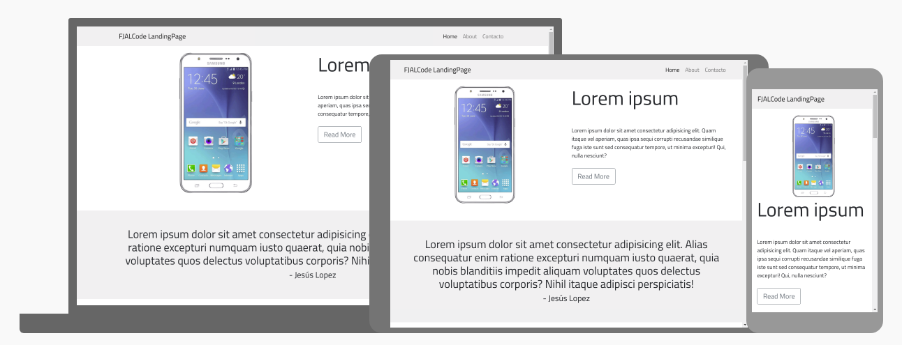

# Landing Page PHONES

Landing page sencilla para muestra de productos basado en los proyectos de Fazt

## GitHub Page

Puedes apreciar la web final a través de [Página Web](https://fjalcode.github.io/landing-page-phone/)



## Pre-requisitos

Para este proyecto se utilizarón las siguientes herramientas

* [Google Fonts](https://fonts.google.com/)
* [Bootstrap](https://getbootstrap.com/)
* [Scroll Reveal](https://scrollrevealjs.org/)
* [Michalsnik](https://michalsnik.github.io/aos/)


## Instalación

[Descargamos](https://github.com/FJALCode/landing-page-phone/archive/master.zip) o clonamos el proyecto a través del siguiente comando

```
git clone https://github.com/FJALCode/landing-page-phone.git
```
## Deployment


## Version

1.0.0

## Autores

<!-- ALL-CONTRIBUTORS-LIST:START - Do not remove or modify this section -->
<!-- prettier-ignore -->
[<br /><sub><b>Fernando Antúnez</b></sub>](https://github.com/FJALCode)<br />[💻](https://github.com/FJALCode "Code") [📢](#talk-Meabed "Talks")
<!-- ALL-CONTRIBUTORS-LIST:END -->

## Licencia

Este proyecto está bajo la [Licencia MIT](LICENSE)

## Expresiones de Gratitud
Este proyecto se realizo gracias al trabajo base de: 
</br>[<br/><sub><b>Fazt</b></sub>](https://github.com/FaztTech)


